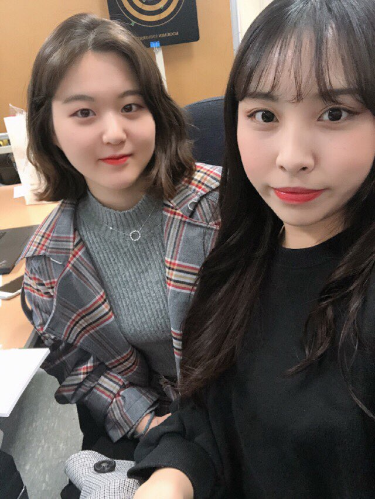

# 프로젝트 소개

**키워드 추천 뉴스 알리미** 

우리는 아주 많은 정보들 속에서 살고 있습니다. 과도하게 많은 정보는 오히려 우리에게 해가 될 수도 있습니다. 신문 기사는 신문사별로 하루에도 100개 넘는 정보들이 업데이트 되고 있습니다. 이제는 많은 정보들 속에서 원하는 것을 찾아서 보는 것 또한 하나의 경쟁력이 되고 있습니다. 우리는 매일 새롭게 업데이트가 되고 있는 뉴스 기사들 사이에서 사용자가 원하는 정보들을 구별해서 보여주는 웹 어플리케이션을 개발할 것입니다.

# 팀 소개

**해보자**

이가영 : https://github.com/gy0216
이승언 : https://github.com/lsebb1007

**팀페이지 주소** 23조 -> https://github.com/kookmin-sw/2018-cap1-23/

# Abstract

We live in a lot of information. Too much information can be harmful to us. Newspaper articles are updated more than 100 times a day by newspapers. Now, finding and looking for what you want in a lot of information is also a competitive advantage. We will develop a web application that will show you what you want to see among news updates that are updated every day.

# 소개 영상
업로드 예정
